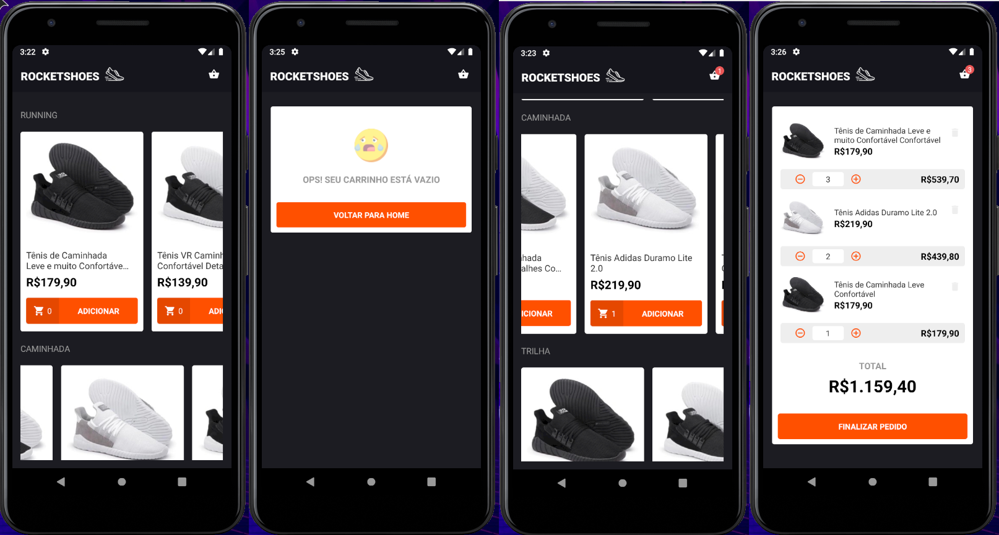

<h1 align="center">
  
</h1>

<h2 align="center">Desafio 07 - Arquitetura Flux</h2>

<p align="center">
  

  <a href="https://www.linkedin.com/in/helitonoliveira/">
    
  </a>

  

  <a href="https://github.com/heliton1988/rocketshoes-mobile/stargazers">
    
  </a>
</p>

<p align="center">
  <a href="#pencil-sobre">Sobre</a>&nbsp;&nbsp;&nbsp;|&nbsp;&nbsp;&nbsp;
  <a href="#wrench-ferramentas-utilizadas">Ferramentas</a>&nbsp;&nbsp;&nbsp;|&nbsp;&nbsp;&nbsp;
  <a href="#tada-como-usar">Como Utilizar</a>&nbsp;&nbsp;&nbsp;|&nbsp;&nbsp;&nbsp;
  <a href="#page_facing_up-licença">Licença</a>
</p>

<h3>
  
</h3>

---

## :pencil: Sobre

A propósta desse desafio foi migrar o projeto de e-commerce criado na web para dispositivos móveis utilizando React native. Mantendo as mesmas funcionalidades tanto no web quanto no mobile<br />

Click aqui ⬇<br />
[Projeto Web](https://github.com/heliton1988/rocketshoes)

## :iphone: Milha extra

Fui um pouco além do proposto!<br />
- Deixei o `layout` da aplicação com as minhas caracteríscas
- Inclui `popup` para um melhor feedback para o usuário
- Implementei um `Scroll` baseado na quantidade de itens do carrinho
- Para uma melhor `experiencia do usuário`, inclui uma tela de carrinha vazio


## :wrench: Ferramentas utilizadas

- [React Native](https://reactnative.dev/)
- [React Navigation](https://reactnavigation.org/)
- [Redux](https://redux.js.org/)
- [Redux-Saga](https://redux-saga.js.org/)
- [Styled Components](https://styled-components.com/)
- [react-native-vector-icon](https://github.com/oblador/react-native-vector-icons#android)
- [React-Native-Intl](https://www.npmjs.com/package/react-native-intl)
- [Immer](https://immerjs.github.io/immer/docs/introduction)
- [Axios](https://github.com/axios/axios)
- [Json-Server](https://www.npmjs.com/package/json-server)

## :tada: Como usar

Para rodar a aplicação localmente é necessário ter as seguintes ferramentas instaladas em seu computador:<br />
`Git`, `Android-Studio`, `yarn` ou `npm`.

```bash
#Clone o repositório
$ git clone https://github.com/heliton1988/rocketshoes-mobile.git

# Acesse a pasta rocketshoes-mobile
$ cd rocketshoes-mobile

# Instale todas as dependências do projeto
$ yarn

# Execute o metro bundler
$ yarn start

# Roda o app
$ yarn android

# Inicie o server
$ yarn dev:server
```

## :page_facing_up: Licença

Esse projeto está sob a licença MIT. Veja o arquivo [LICENSE](https://github.com/rocketseat-education/bootcamp-gostack-desafio-07/blob/master/LICENSE.md) para mais detalhes.

---

Feito com 💙 by [Héliton Oliveira](https://www.linkedin.com/in/helitonoliveira/) 👋 !!!
